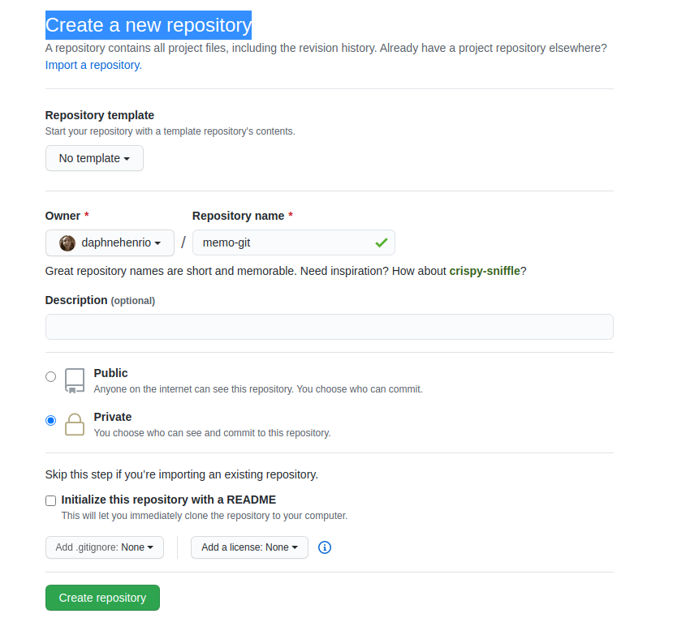
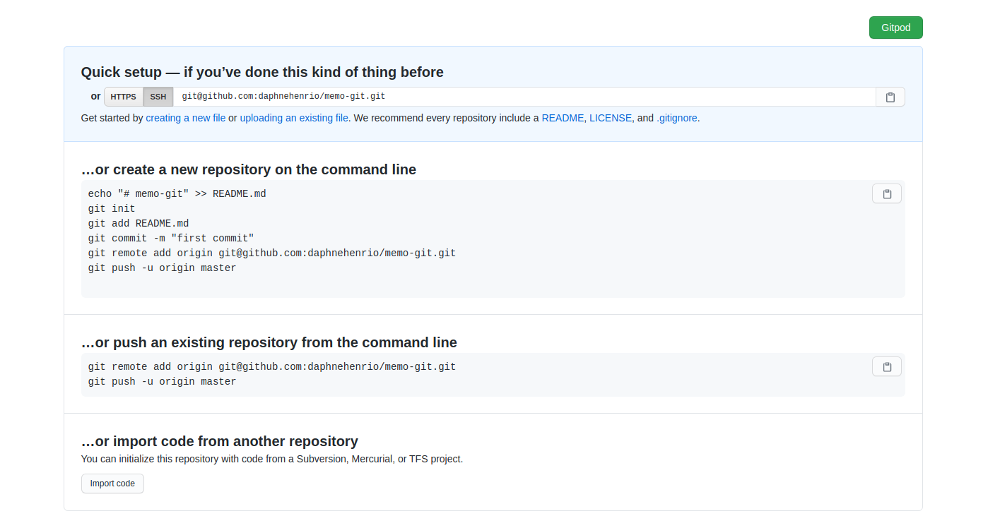
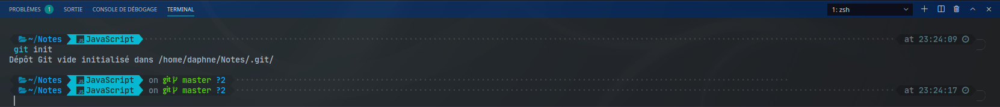
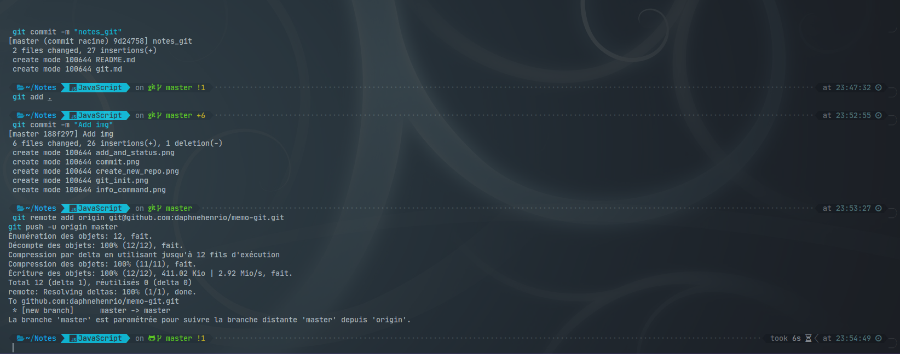

# GIT

## Windows

Effectiment après réflexion, je vois le pk du git bash qui m'étais sorti de la tête … Le prochain tuto c'est on installe linux :P

Du coup oui faut l'installer.
Ce petit [lien](https://gitforwindows.org/) me parait très bien.

Une fois installé tu navigues dans tes dossiers en ligne de commande. Il me semble qu'on à déjà vu ça et que je t'ai déjà filer des notes, mai au besoin rappel :

- `pwd` : savoir ou tu es
- `ls` : liste les fichiers du dossiers courrant
- `cd dossier/sous_dossier/sous_sous_dossier` : naviguer dans les dossiers à partir de l'endroit ou te trouve (on reverra ça er vocal au besoin mais t'inquiète c'est simple)
- `cd ..` : revenir en arrière d'un dossier
- `cd ../..` : revenir en arrière de 2 dossiers
- `cd ../../..` : je te laisse deviner :P
- `code .` : pour ouvrir le dosser courrant dans vs code.

Dans l'immédiat avec les 3 4 commande de git de base, ça me parrait suffirsant, on verra par la suite quand tu auras besoin de plus.


## Creer le repos sur github



Après ça, on tombe sur cette page que l'on garde de côté pour trouver les 2 ligne de commande après le commit pour 1er push



## Initialiser le projet

Dans un terminal à la racine du projet :

```bash
git init
```

-> initialise git dans le dossier



## Commit & push

Toujours dans le terminal à la racine du projet :

```bash
git add .
git commit -m "nom du commit"
git remote add origin git@github.com:username/repo_name.git
git push -u origin master
```



-> permet de faire le 1er commit push ensuite on fera simplement:

```bash
git add .
git commit -m "nom du commit"
git push
```

## Branch

Toujours dans le terminal au même endroit :

```bash
git checkout -b "nom de la branche"
```

-> permet de créer et de bascler sur la nouvelle branche.
